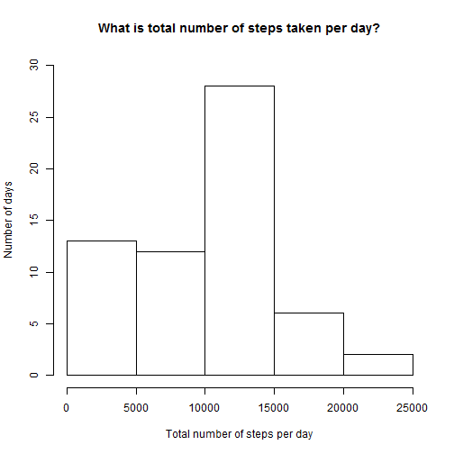
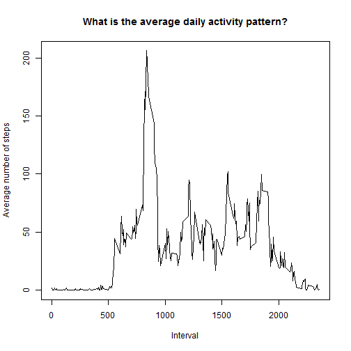
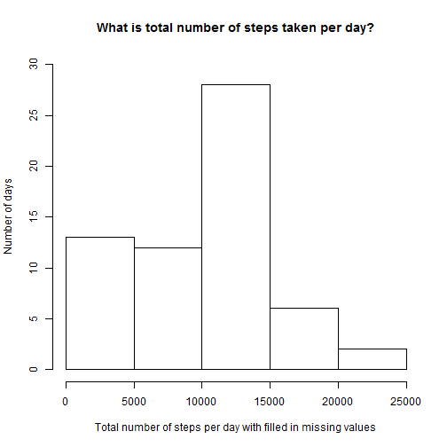
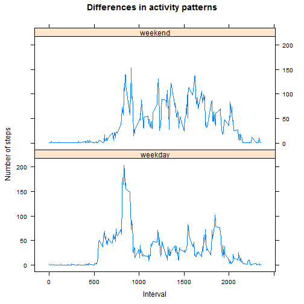

# Peer-graded Assignment: Course Project 1  
## Vladas Alesius  
### Introduction  

The purpose of this project is to analyze data about personal movement.  
The data consists of two months of data from an anonymous individual collected 
during the months of October and November, 2012 and include the number of steps 
taken in 5 minute intervals each day.  

The variables included in this dataset are:

* steps: Number of steps taking in a 5-minute interval (missing values are coded as NA)
* date: The date on which the measurement was taken in YYYY-MM-DD format
* interval: Identifier for the 5-minute interval in which measurement was taken  

The analysis will consist of several parts.  

NOTE: Set your working directory in the way you could the read the data and export
the output, in case you would like to reproduce the results.

#### Part 1  

Firstly, raw data is unzipped and read.


```r
unzip("activity.zip")
act<-read.csv("activity.csv")
```

#### Part 2  
 
Now we are going to check what total number of steps taken per day is.
We will make a histogram demonstrating numbers of the total number of steps taken each day.


```r
totalsteps<-tapply(act$steps, act$date, sum, na.rm=TRUE)
```


```r
hist(totalsteps,xlab="Total number of steps per day", ylab="Number of days",  
main="What is total number of steps taken per day?", ylim=c(0,30))
```



As you can see, the number of steps is between 10 and 15
thousand steps for most days. Also, there are more days with a smaller
number of steps than with a bigger one.

The mean and median number of steps taken each day are provided below:


```r
mean(totalsteps)
```

```
## [1] 9354.23
```

```r
median(totalsteps)
```

```
## [1] 10395
```

#### Part 3  

The next step is to analyze daily activity pattern.
Below you see a time series plot of the 5-minute interval (x-axis) and 
the average number of steps taken, averaged across all days (y-axis):


```r
pattern<-tapply(act$steps, act$interval, mean, na.rm=TRUE)
pattern2<-as.data.frame.table(pattern)
colnames(pattern2)<-c("interval","steps")
intervals<-as.numeric(as.character(pattern2$interval))
```


```r
plot(intervals,pattern2$steps,type="l",main="What is the average daily activity pattern?",  
xlab="Interval",ylab="Average number of steps")
```



As we can see in this plot, the lowest activity is during first 500 intervals,
and after 2000th interval. The highest activity is on about 800th interval, it
fluctuates after that, but decreases in general.  

Also, we can find the interval containing the biggest average number of steps:


```r
maxinterval<-as.numeric(as.character(pattern2[which.max(pattern2[,2]),1]))
maxinterval
```

```
## [1] 835
```

#### Part 4  

Unfortunately, the data is not full - some days/intervals have a missing 
value for number of steps. Here is how many missing entries there are:  


```r
sum(is.na(act$steps))
```

```
## [1] 2304
```

In order to reduce bias in our calculations, we should choose the way to
fill in the missing values. There are several strategies, we will select
a mean for that 5-minute interval. For this reason, the initial data set 
is copied. Missing values will be replaced with the means of the respective 
intervals in the copy of the data. Computations from Part 3 will be used for this purpose.


```r
act2<-act
na<-which(is.na(act2$steps))
act2[na,1]<-pattern2[which(pattern2[1,]==act2[na,3]),2]
totalsteps2<-tapply(act2$steps, act2$date, sum, na.rm=TRUE)
```


```r
hist(totalsteps2, xlab="Total number of steps per day with filled in missing values",   
ylab="Number of days",main="What is total number of steps taken per day?", ylim=c(0,30))
```



In this case, the histogram looks in a very similar way as in Part 2.  
  
We will also examine the effect of missing value replacement 
on results of our calculations, in particular - 
mean and median values of number of steps.


```r
mean(totalsteps2)
```

```
## [1] 9419.081
```

```r
median(totalsteps2)
```

```
## [1] 10395
```

As we can see, mean of number of steps gets a bit higher, but the median
remains the same. So the effect of missing value replacement is not
very significant.  

#### Part 5  

The last part of our analysis is to examine the difference of movement
patterns for weekends and weekdays. For this purpose, we will make a 
time series plot of the 5-minute interval (x-axis) and the average number 
of steps taken, averaged across all weekday days or weekend days (y-axis).
We will be using the copy of data set with filled in missing values.
Also, we will add a new factor variable indicating whether a given date 
is a weekday or weekend day. 


```r
wd<-weekdays(as.Date(act2$date,"%Y-%m-%d"))
act2$day<-as.factor(ifelse(wd == "Saturday" | wd == "Sunday","weekend","weekday"))
averagesteps<-tapply(act2$steps, list(act2$day, act2$interval), mean, na.rm=TRUE)
averagesteps2<-as.data.frame.table(averagesteps)
colnames(averagesteps2)<-c("day","interval","stepsaverage")
intervals<-as.numeric(as.character(averagesteps2$interval))
```


```r
library(lattice) 
xyplot(averagesteps2$stepsaverage~intervals|averagesteps2$day,xlab="Interval",  
ylab="Number of steps",main="Differences in activity patterns",type="l",layout=c(1,2))
```



As we can see from this plot, the activity pattern for weekdays is very similar to
the general one - activity is very low in the beginning of the day, but starts rising
after 500th interval and reaches its peak on about 800th interval. After that, it gets lower,
although fluctuating, and goes to almost zero again after 2000th interval.  
  
For weekends, the pattern is a bit different. Similarly to weekdays, the activity
increases aftet first 500 intervals, and fluctuates until 2000th interval. It goes to almost 
zero after that.   


